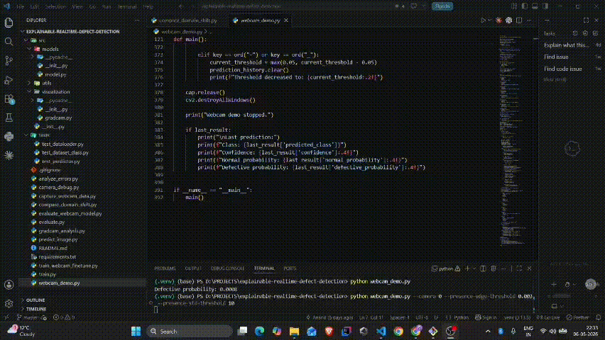
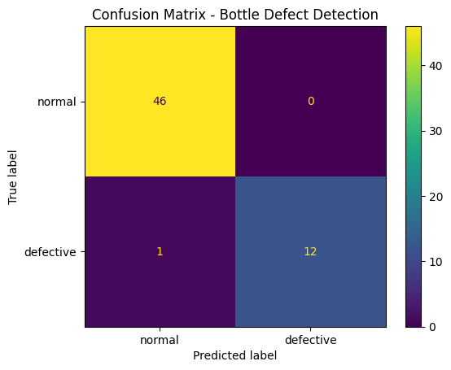
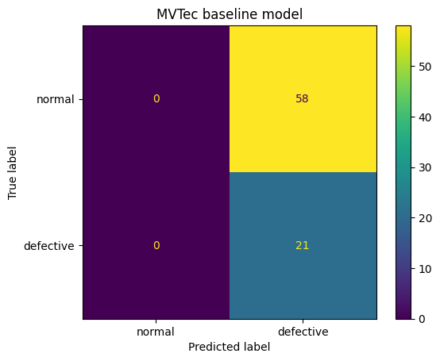
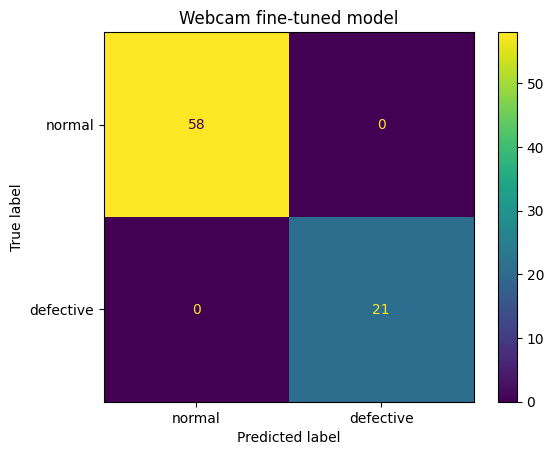
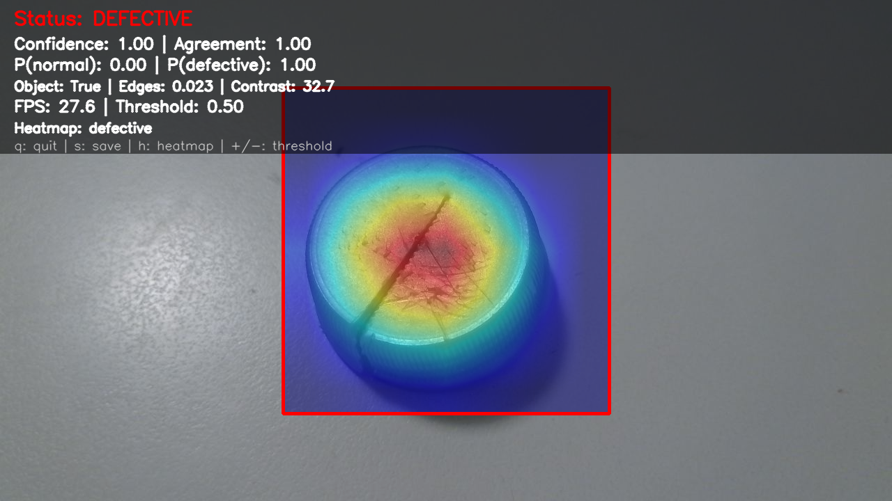
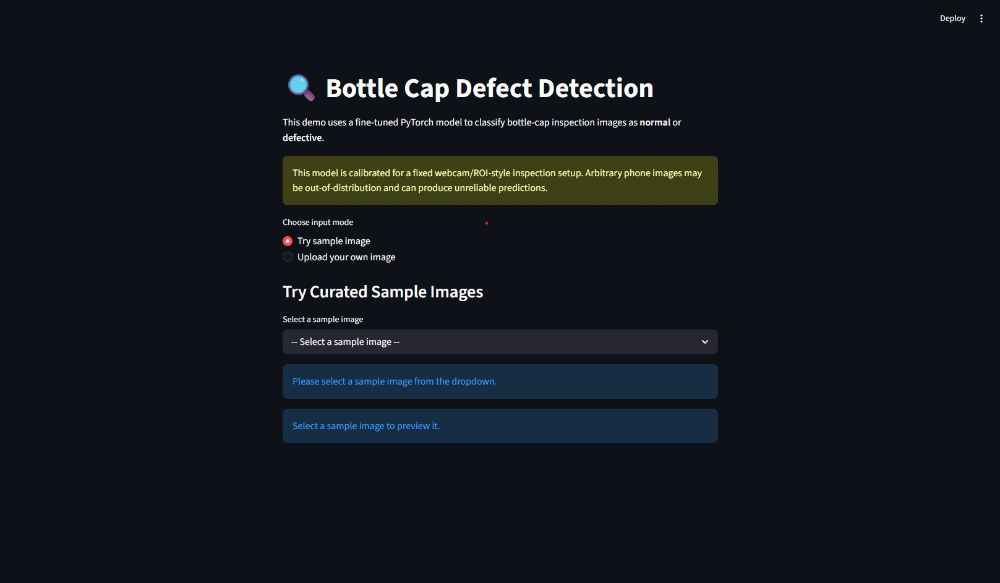
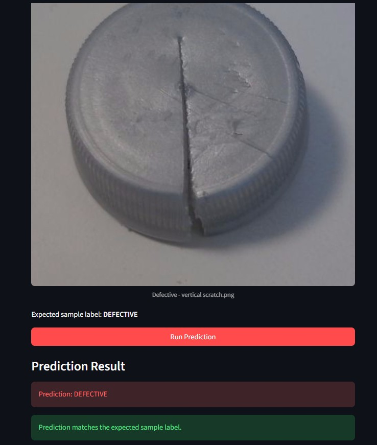
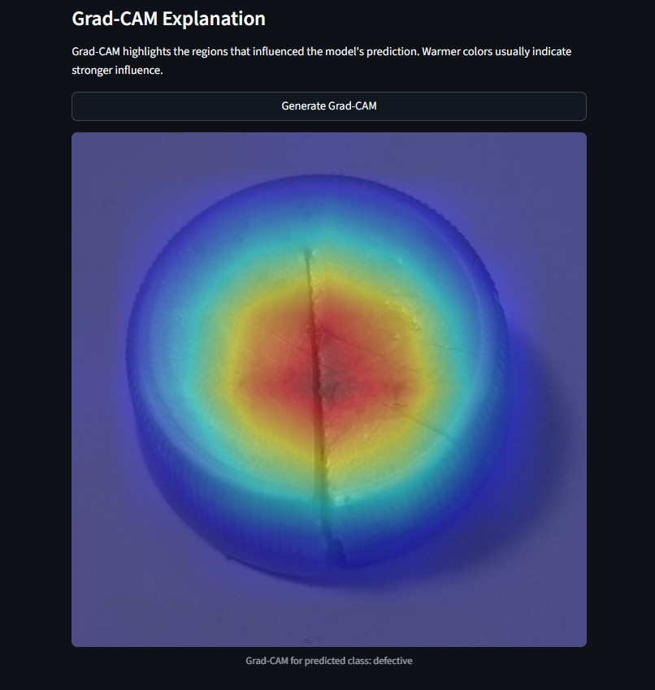

# Explainable Real-Time Defect Detection for Bottle Cap Inspection

A real-time, explainable computer vision inspection prototype for bottle-cap defect detection using **PyTorch**, **OpenCV**, **Grad-CAM**, **FastAPI**, **Docker**, and **Streamlit**.

This project started with a benchmark defect-detection model trained on the **MVTec AD bottle dataset**, then moved toward a more realistic live inspection scenario using a custom webcam-based bottle-cap dataset. The main focus is not only model accuracy, but the full applied machine learning workflow: **domain shift analysis, camera-specific fine-tuning, real-time inference, explainability, API serving, containerization, and UI-based demonstration**. 

---

## Demo



The demo shows the real-time webcam inspection workflow with normal caps, printed-normal caps, defective caps, and on-demand Grad-CAM heatmaps.

Full demo video: [demo_webcam_inspection.mp4](reports/figures/demo_webcam_inspection.mp4)

---

## Quick Start / How to Run

> Model weights are not committed to Git. Before running inference, place the fine-tuned model here:
>
> ```text
> models/resnet18_webcam_caps_finetuned_v2.pth
> ```

### 1. Streamlit Demo UI

Interactive frontend with sample images, upload option, prediction results, and Grad-CAM.

```bash
streamlit run app/streamlit_app.py
```

Open:

```text
http://localhost:8501
```

### 2. Real-Time Webcam Demo

Live webcam inspection with ROI, object detection, smoothing, and on-demand Grad-CAM.

```bash
python webcam_demo.py --camera 0
```

Controls:

```text
q = quit | s = save frame | h = Grad-CAM | + / - = threshold
```

If camera index `0` does not work:

```bash
python webcam_demo.py --camera 1
```

### 3. FastAPI Inference API

Image-upload API for model prediction.

```bash
uvicorn api.main:app --reload
```

Open:

```text
http://127.0.0.1:8000/docs
```

Use `POST /predict` to upload an image and get a JSON response.

### 4. Dockerized API

Run the FastAPI service inside Docker.

```bash
docker build -t defect-detection-api .
docker run -p 8000:8000 defect-detection-api
```

Open:

```text
http://127.0.0.1:8000/docs
```

## Key Highlights

* Built a real-time OpenCV inspection system for bottle-cap defect detection.
* Identified domain shift between benchmark MVTec data and live webcam data.
* Collected a custom webcam calibration dataset and fine-tuned a ResNet18 model.
* Improved robustness by adding printed/logo caps as normal variation.
* Added Grad-CAM explanations for model interpretability.
* Exposed inference through a FastAPI `/predict` endpoint.
* Containerized the API using Docker.
* Built a Streamlit UI with curated sample images, manual prediction, and Grad-CAM visualization.

---

## Project Overview

The system classifies bottle-cap images into two classes:

```text
normal | defective
```

It supports three main usage modes:

1. **Real-time webcam inspection** using OpenCV.
2. **Image-based API inference** using FastAPI.
3. **Interactive demo UI** using Streamlit.

The real-time demo includes:

* fixed inspection region / ROI
* object presence detection
* prediction smoothing
* confidence score
* defect threshold control
* FPS display
* on-demand Grad-CAM heatmap

---

## Project Story

Many beginner defect-detection projects stop after training a model on a benchmark dataset and reporting accuracy.

This project goes further.

The first model was trained on the **MVTec AD bottle** dataset. It worked well on benchmark-style bottle images, but when tested on live webcam bottle-cap images, it failed because the camera setup, object appearance, lighting, background, and image distribution were different.

This is a classic **domain shift** problem.

To solve it, I collected a custom webcam-based bottle-cap dataset, fine-tuned the model for the target inspection setup, tested real-time webcam inference, and added explainability using Grad-CAM.

The workflow became:

```text
MVTec benchmark model
↓
works on benchmark images
↓
fails on webcam bottle-cap data
↓
domain shift identified
↓
custom webcam calibration dataset collected
↓
model fine-tuned for target camera setup
↓
false positives on printed caps discovered
↓
printed/logo caps added as normal variation
↓
model fine-tuned again
↓
real-time webcam inspection works
↓
Grad-CAM explanations added
↓
FastAPI + Docker + Streamlit interfaces added
```

This makes the project closer to a realistic inspection prototype rather than a generic image-classification notebook.

---

## Results

### Domain Shift Comparison

The original MVTec-trained model performed poorly on webcam bottle-cap images because it was not trained on the target camera setup.

| Model                   | Evaluation Data       | Accuracy | Precision | Recall | F1-score |
| ----------------------- | --------------------- | -------: | --------: | -----: | -------: |
| MVTec baseline model    | Webcam cap test split |   0.2658 |    0.2658 | 1.0000 |   0.4200 |
| Webcam fine-tuned model | Webcam cap test split |   1.0000 |    1.0000 | 1.0000 |   1.0000 |

The baseline model classified most webcam cap images as defective, which showed that benchmark performance did not transfer to the live inspection setup.

After collecting camera-specific data and fine-tuning, the model performed correctly on the held-out webcam calibration split.

> **Note:** The 100% result is on a held-out webcam calibration split. It is not a claim of production-level real-world accuracy.

---

## Visual Results

### 1. Baseline Model on Original MVTec Bottle Data

The initial ResNet18 model performed well on the original MVTec bottle test split.



### 2. Domain Shift: MVTec Model on Webcam Cap Data

When the same MVTec-trained model was tested on webcam bottle-cap images, it classified almost everything as defective. This clearly shows that the benchmark model did not transfer to the live camera setup.



### 3. After Webcam Fine-Tuning

After collecting webcam-specific calibration data and fine-tuning the model, performance improved on the held-out webcam calibration split.



### 4. Real-Time Grad-CAM Example

The webcam demo supports on-demand Grad-CAM explanations. Pressing `h` generates a heatmap for the current inspection region.

In the defective example below, the model predicts `DEFECTIVE` with high confidence and the Grad-CAM heatmap highlights the damaged cap region.



---

## Streamlit Frontend Demo

The Streamlit UI provides an interactive way to test the model without using the webcam directly.

It supports two input modes:

1. **Curated sample images**
   Users can select prepared normal and defective cap examples from the project.

2. **Custom image upload**
   Users can upload their own image. The UI includes a warning that arbitrary phone images may be out-of-distribution because the model is calibrated for a fixed webcam/ROI-style setup.

The frontend workflow is:

```text
Select sample image / upload image
        ↓
Preview input image
        ↓
Click Run Prediction
        ↓
Show predicted class and confidence
        ↓
Show normal/defective probabilities
        ↓
Click Generate Grad-CAM
        ↓
Show heatmap explanation
```

### Sample Selection







---

## System Architecture

### Real-Time Inspection Path

```text
Webcam frame
    ↓
Center ROI extraction
    ↓
Object presence detection
    ↓
Image preprocessing
    ↓
Fine-tuned ResNet18 model
    ↓
Normal / defective prediction
    ↓
Confidence + probabilities
    ↓
Optional Grad-CAM heatmap
    ↓
Live OpenCV display
```

### API Inference Path

```text
Uploaded image
    ↓
FastAPI /predict endpoint
    ↓
DefectPredictor
    ↓
PyTorch model inference
    ↓
JSON prediction response
    ↓
Docker container
```

### Streamlit Demo Path

```text
Sample image / uploaded image
    ↓
Preview in Streamlit UI
    ↓
Run Prediction button
    ↓
Prediction + probabilities
    ↓
Generate Grad-CAM button
    ↓
Heatmap visualization
```

---

## Features

### Computer Vision Pipeline

* PyTorch custom dataset
* train/validation/test splitting
* ResNet18 binary classifier
* transfer learning and fine-tuning
* class-weighted loss for imbalance handling
* evaluation metrics and confusion matrix
* error analysis

### Real-Time Inspection

* OpenCV webcam capture
* center ROI inspection zone
* object presence gate
* prediction smoothing
* adjustable defect threshold
* FPS display
* frame saving
* on-demand Grad-CAM heatmap

### Explainability

* Grad-CAM support for CNN model explanations
* heatmap overlay on inspection region
* Streamlit Grad-CAM visualization
* webcam on-demand heatmap using keyboard control

### Deployment Interfaces

* FastAPI `/predict` endpoint for image upload inference
* Dockerized FastAPI service
* Streamlit UI for user-friendly demos
* curated sample images for users without access to the webcam setup

---

## Project Structure

```text
explainable-realtime-defect-detection/
│
├── api/
│   ├── __init__.py
│   └── main.py                         # FastAPI inference API
│
├── app/
│   └── streamlit_app.py                # Streamlit demo UI
│
├── assets/
│   └── sample_images/                  # Curated demo images for Streamlit
│
├── data/                               # Local datasets, not committed
│   ├── mvtec_ad/
│   └── webcam_bottle_caps/
│
├── models/                             # Local model weights, not committed
│
├── outputs/                            # Generated outputs/results
│   ├── heatmaps/
│   ├── misclassifications/
│   ├── predictions/
│   └── webcam_captures/
│
├── reports/
│   └── figures/                        # Figures used in README/report
│
├── src/                                # Reusable source code
│   ├── data/
│   │   ├── dataset.py
│   │   ├── prepare_data.py
│   │   └── prepare_webcam_data.py
│   │
│   ├── inference/
│   │   └── predictor.py
│   │
│   ├── models/
│   │   └── model.py
│   │
│   └── visualization/
│       └── gradcam.py
│
├── tests/                              # Test/sanity-check scripts
│
├── tools/
│   └── camera_debug.py                 # Camera/backend debugging utility
│
├── analyze_errors.py
├── compare_domain_shift.py
├── capture_webcam_data.py
├── evaluate.py
├── evaluate_webcam_model.py
├── gradcam_analysis.py
├── predict_image.py
├── train.py
├── train_webcam_finetune.py
├── webcam_demo.py
│
├── Dockerfile
├── .dockerignore
├── requirements.txt
├── requirements-api.txt
├── README.md
└── .gitignore
```

---

## Setup

### 1. Clone the Repository

```bash
git clone <your-repo-url>
cd explainable-realtime-defect-detection
```

### 2. Create a Virtual Environment

Windows PowerShell:

```powershell
python -m venv .venv
.\.venv\Scripts\Activate.ps1
```

### 3. Install Dependencies

```powershell
pip install -r requirements.txt
```

For CUDA-enabled PyTorch, install the correct PyTorch build from the official PyTorch installation selector based on your GPU and CUDA support.

---

## Model Files

Model weights are not committed to Git because `.pth` files can be large.

Expected model paths:

```text
models/resnet18_bottle_binary.pth
models/resnet18_webcam_caps_finetuned.pth
models/resnet18_webcam_caps_finetuned_v2.pth
```

The main demo model is:

```text
models/resnet18_webcam_caps_finetuned_v2.pth
```

---

## Dataset

### MVTec Baseline Dataset

The initial baseline was trained on the MVTec AD bottle category.

Expected local structure:

```text
data/mvtec_ad/bottle/
├── train/
│   └── good/
├── test/
│   ├── good/
│   ├── broken_large/
│   ├── broken_small/
│   └── contamination/
└── ground_truth/
```

### Webcam Bottle-Cap Dataset

The webcam fine-tuning dataset was collected using the project’s camera capture script.

Expected local structure:

```text
data/webcam_bottle_caps/
├── normal/
└── defective/
```

The dataset is not committed to Git. Only curated demo samples are committed under:

```text
assets/sample_images/
```

---

## Training

### Train Baseline MVTec Model

```bash
python train.py
```

This trains a ResNet18 binary classifier on the MVTec bottle data and saves:

```text
models/resnet18_bottle_binary.pth
```

### Fine-Tune on Webcam Bottle-Cap Data

```bash
python train_webcam_finetune.py
```

This loads an existing model and fine-tunes it on the webcam bottle-cap dataset.

Example final model:

```text
models/resnet18_webcam_caps_finetuned_v2.pth
```

---

## Evaluation

### Evaluate MVTec Baseline

```bash
python evaluate.py
```

### Evaluate Webcam Fine-Tuned Model

```bash
python evaluate_webcam_model.py
```

### Compare Domain Shift

```bash
python compare_domain_shift.py
```

This compares the original MVTec model and the webcam fine-tuned model on the webcam cap test split.

Outputs include:

```text
outputs/domain_shift_comparison.csv
outputs/confusion_matrix_mvtec_baseline_model.png
outputs/confusion_matrix_webcam_fine-tuned_model.png
```

---

## Real-Time Webcam Demo

Run:

```bash
python webcam_demo.py --camera 0
```

If object detection is too strict or too loose, adjust thresholds:

```bash
python webcam_demo.py --presence-edge-threshold 0.003 --presence-std-threshold 10
```

### Controls

```text
q  -> quit
s  -> save current frame
h  -> generate Grad-CAM heatmap
+  -> increase defect threshold
-  -> decrease defect threshold
```

### Expected Behavior

```text
empty ROI        -> WAITING FOR OBJECT
normal cap       -> NORMAL
printed cap      -> NORMAL
damaged/cut cap  -> DEFECTIVE
```

---

## FastAPI Inference API

The API exposes the trained model through an image-upload endpoint.

### Run Locally

```bash
uvicorn api.main:app --reload
```

Open:

```text
http://127.0.0.1:8000/docs
```

### Endpoints

```text
GET  /
GET  /health
POST /predict
```

### Example API Response

```json
{
  "filename": "defective_cap.png",
  "predicted_class": "defective",
  "predicted_label": 1,
  "confidence": 1.0,
  "normal_probability": 0.0,
  "defective_probability": 1.0,
  "threshold": 0.5,
  "device": "cuda"
}
```

---

## Dockerized API

Build the Docker image:

```bash
docker build -t defect-detection-api .
```

Run the container:

```bash
docker run -p 8000:8000 defect-detection-api
```

Then open:

```text
http://127.0.0.1:8000/docs
```

Inside Docker, the model may run on CPU unless GPU support is configured separately.

---

## Streamlit Demo UI

Run:

```bash
streamlit run app/streamlit_app.py
```

The Streamlit UI supports:

* curated sample image selection
* custom image upload
* manual prediction button
* confidence and probability display
* expected label check for sample images
* Grad-CAM explanation generation

The curated sample images allow users to test the model even if they do not have access to the physical webcam setup.

---

## Input Assumptions

This model is calibrated for a fixed webcam/ROI-style inspection setup.

It expects images where:

* the bottle cap is centered
* the cap is viewed from a similar angle
* lighting/background are similar to the calibration setup
* the object is captured in an ROI-style inspection view

Arbitrary phone images may be out-of-distribution and can produce unreliable predictions unless additional phone-image calibration data is added.

---

## Explainability with Grad-CAM

Grad-CAM is used to visualize which regions influenced the model prediction.

In the webcam demo:

```text
press h -> generate heatmap for current ROI
```

In Streamlit:

```text
Run Prediction -> Generate Grad-CAM
```

Grad-CAM is used on demand because it requires an additional backward pass and is slower than normal inference.

---

## Limitations

This project is a prototype, not a production inspection system.

Current limitations:

* calibrated mainly for a fixed webcam bottle-cap inspection setup
* small custom dataset
* limited number of physical defective samples
* phone images may be out-of-distribution
* Grad-CAM gives rough localization, not pixel-perfect defect segmentation
* Docker image is large because it includes PyTorch
* no production monitoring or drift detection yet

---

## Future Improvements

Potential next steps:

* add more physical defect types
* collect more varied normal and defective caps
* add phone-image calibration set if phone uploads should be supported
* export model to ONNX for smaller/faster deployment
* compare ResNet18 with MobileNetV3 or EfficientNet-B0
* add prediction logging to CSV or SQLite
* add uncertainty handling for low-confidence predictions
* deploy Dockerized API on AWS EC2
* create a stronger architecture diagram
* improve robustness testing under lighting/blur/background changes

---

## Tech Stack

```text
Python
PyTorch
Torchvision
OpenCV
Pillow
Scikit-learn
Matplotlib
FastAPI
Uvicorn
Docker
Streamlit
Grad-CAM
```


---

## Project Status

Current status:

```text
Baseline training completed
Webcam domain shift analyzed
Webcam fine-tuning completed
Real-time OpenCV demo working
Grad-CAM explainability added
FastAPI inference API working
Dockerized API working
Streamlit UI working
```
